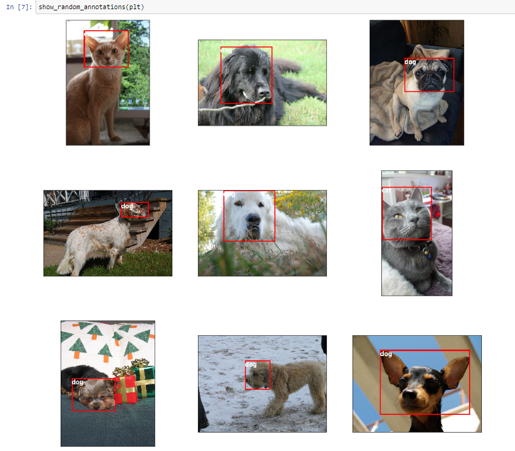
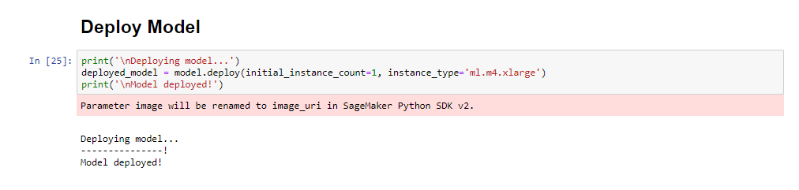
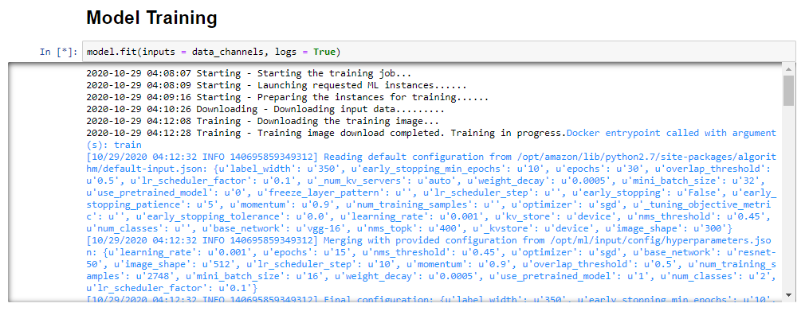

# SageMaker-Object-Detection
- In this project, I used an Amazon Sagemaker p type instance to train and deploy an object detector. There are many different algorithms available in Sagemaker, for this project, I used the SSD Object Detection algorithm to train and deploy a model which will locate and recognize dogs’ and cats’ faces on a picture. The data was taken from the IIIT-Oxford Pets Dataset.

- Please see included jupyter notebook for detailed code.

